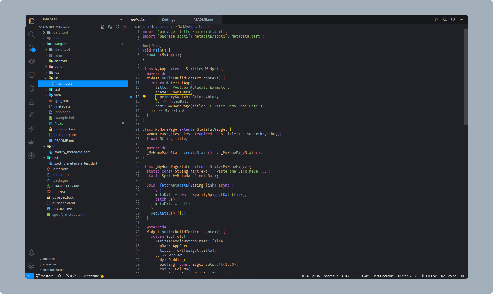

# [One for all theme](https://marketplace.visualstudio.com/items?itemName=100lvlmaster.one-for-all-theme)

# 🚀

⚡ A theme that follows Atom's one dark pro scheme
but with minimal theme colors are consistent

## Screenshots

### Code snippet

### Editor

### Settings

### Markdown preview

# Darker

### Code snippet

### Editor

### Settings

### Markdown preview

Thanks for using the theme.

[My website](https://navinko.netlify.app)

You can reach out to me on anywhere lol.

If you want to help,

😃 Thanksssssssssss
